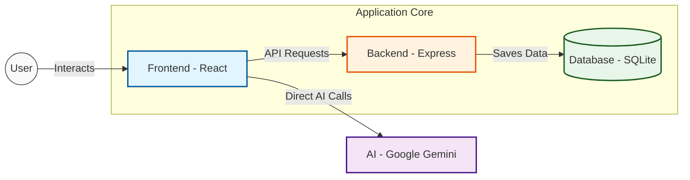

# ScholarFocus Architecture

This document outlines the technical structure and data flow of the ScholarFocus application.

## System Overview

ScholarFocus is a full-stack application built with React 19, Express.js, and Google Gemini AI. It uses a "Hardware Tool" aesthetic to provide a tactile, focused study environment.

## Architecture Diagram

## Key Technologies

- **Frontend**: React 19, Vite, Tailwind CSS 4, Motion (Framer Motion).
- **Backend**: Node.js, Express.js, Socket.io (Real-time).
- **Database**: SQLite (via `better-sqlite3`).
- **AI**: Google Gemini API via `@google/genai`.

## Data Flow

1. **User Interaction**: The user interacts with the React UI.
2. **AI Requests**: The frontend calls the Gemini API directly for tutoring and context blocking.
3. **Task Management**: CRUD operations for tasks are sent to the Express API and stored in SQLite.
4. **Real-time Collaboration**: Study Circles use Socket.io for P2P presence signaling.
5. **Privacy**: Webcam data for focus monitoring stays 100% local to the browser.
