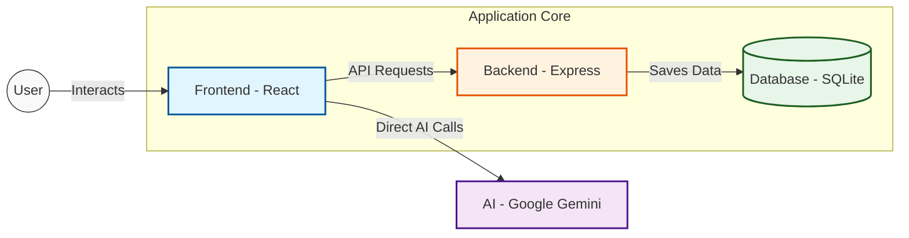

# 🐠 FISH - Focus Intensive Student Habitation

> **Transforming how ambitious students learn with AI-powered focus tracking, intelligent tutoring, and collaborative study environments.**

[](https://fish-study.netlify.app)
[](https://ai.google.dev/gemini-api)
[](https://reactjs.org/)

---

## 🎯 **What is FISH?**

FISH (Focus Intensive Student Habitation) is a comprehensive learning platform designed for students who are serious about maximizing their academic potential. We combine cutting-edge AI technology with proven productivity methodologies to create an environment where deep learning thrives.

### **🌟 Key Features**

- **🧠 AI Socratic Tutor**: SOCRATES, our AI tutor, guides you through concepts using the Socratic method, helping you deepen your understanding rather than just giving answers.
- **⏱️ Advanced Pomodoro Timer**: Customizable focus sessions with intelligent break optimization to keep you productive without burnout.
- **📊 Focus Analytics**: Track your attention patterns and optimize your study habits with data-driven insights.
- **📝 Smart Note-Taking**: AI-enhanced knowledge base with intelligent organization to keep your study materials structured.
- **👥 Study Circles**: Collaborative learning groups with real-time interaction to foster peer support and accountability.
- **🏆 Gamified Progress**: Leaderboards and achievement systems to maintain motivation and make studying rewarding.
- **🎯 Distraction Blocker**: AI-generated focus protocols tailored to your study material to minimize interruptions.

---

## 📂 **Project Structure**

The project is organized as a monorepo with separate backend and frontend directories:

```
FISH---Focus-intense-Student-Habitation-/
├── ARCHITECTURE.md          # System architecture and design documentation
├── README.md                # Project documentation
├── backend/                 # Node.js + Express backend
│   ├── config/              # Configuration files (database, etc.)
│   ├── package.json         # Backend dependencies and scripts
│   ├── server.js            # Main backend entry point
│   ├── server.ts            # TypeScript server definition
│   ├── setup-backend.sh     # Setup script for the backend environment
│   └── routes/              # API routes definitions
├── frontend/                # React + Vite frontend
    ├── index.html           # HTML entry point
    ├── netlify.toml         # Netlify deployment configuration
    ├── package.json         # Frontend dependencies and scripts
    ├── postcss.config.js    # PostCSS configuration
    ├── tailwind.config.js   # Tailwind CSS configuration
    ├── tsconfig.json        # TypeScript configuration
    ├── vite.config.ts       # Vite project configuration
    └── src/                 # Source code
        ├── App.tsx          # Main application component
        ├── main.tsx         # Application entry point
        ├── components/      # React components (Dashboard, Chatbot, etc.)
        ├── contexts/        # React Context providers (AuthContext)
        └── services/        # API service integrations
                  # Additional project resources
```

---

## 🛠️ **Tech Stack**

- **Frontend**: 
  - React 19 + TypeScript
  - Vite (Build tool)
  - Tailwind CSS 4 (Styling)
  - Motion (Animations)
  - Socket.io Client (Real-time features)

- **Backend**:
  - Node.js + Express
  - SQLite (Database)
  - Socket.io (Real-time server)
  - BCrypt (Security)

- **AI Integration**:
  - Google Gemini API (via `@google/genai`)

---

## 🚀 **Quick Start**

### **Prerequisites**
- Node.js 18+ 
- A [Google AI API key](https://aistudio.google.com/app/apikey)

### **Installation**

1. **Clone the repository**
   ```bash
   git clone https://github.com/Abunesh126/FISH---Focus-intense-Student-Habitation-.git
   cd FISH---Focus-intense-Student-Habitation-
   ```

2. **Frontend Setup**
   ```bash
   cd frontend
   npm install
   # Create .env file with your API keys
   npm run dev
   ```

3. **Backend Setup**
   ```bash
   cd backend
   npm install
   # Configure environment
   node scripts/setup.js # or use setup-backend.sh
   npm start
   ```

---

## 🤝 **Contributing**

Contributions are welcome! Please feel free to submit a Pull Request.

1. Fork the project
2. Create your feature branch (`git checkout -b feature/AmazingFeature`)
3. Commit your changes (`git commit -m 'Add some AmazingFeature'`)
4. Push to the branch (`git push origin feature/AmazingFeature`)
5. Open a Pull Request


architecture
# ScholarFocus Architecture

This document outlines the technical structure and data flow of the ScholarFocus application.

## System Overview

ScholarFocus is a full-stack application built with React 19, Express.js, and Google Gemini AI. It uses a "Hardware Tool" aesthetic to provide a tactile, focused study environment.

## Architecture Diagram



## Key Technologies

- **Frontend**: React 19, Vite, Tailwind CSS 4, Motion (Framer Motion).
- **Backend**: Node.js, Express.js, Socket.io (Real-time).
- **Database**: SQLite (via `better-sqlite3`).
- **AI**: Google Gemini API via `@google/genai`.

## Data Flow

1. **User Interaction**: The user interacts with the React UI.
2. **AI Requests**: The frontend calls the Gemini API directly for tutoring and context blocking.
3. **Task Management**: CRUD operations for tasks are sent to the Express API and stored in SQLite.
4. **Real-time Collaboration**: Study Circles use Socket.io for P2P presence signaling.
5. **Privacy**: Webcam data for focus monitoring stays 100% local to the browser.
